# DomainSeeker

DomainSeeker is a computational workflow  that integrates AlphaFold2-predicted structures with experimental data to identify protein domains in cryo-ET density maps. DomainSeeker partitions AlphaFold2-predicted structures into domains using clique analysis based on predicted aligned errors, then fits these domains into target densities segmented from input cryo-ET maps. Each domain–density fit is evaluated globally and locally to derive prior probabilities, which are subsequently integrated with complementary data, such as cross-linking mass spectrometry (XL-MS), through Bayesian inference to compute posterior probabilities.

This repository provides a plugin for ChimeraX (**DomainSeeker_plugin**), offering an interactive graphical interface. The plugin's underlying scripts can also be invoked directly from the command line (see [Command Line Usage](#command-line-usage)). As of version 1.1, the standalone **DomainSeeker_CLI** is removed — use the plugin scripts instead.

# DomainSeeker_plugin

Support Windows, Linux, Mac

## Installation

### Install ChimeraX

Install UCSF ChimeraX ≥1.6  [(https://www.cgl.ucsf.edu/chimerax/)](https://www.cgl.ucsf.edu/chimerax/).

The recommanded version is 1.10.

### Install DomainSeeker

To install DomainSeeker, enter the following command in the ChimeraX command line:

```
devel install DomainSeeker_plugin_path
```

"DomainSeeker_plugin_path" refers to the file path of the "DomainSeeker_plugin" folder after you have downloaded and extracted it.

Any required dependencies will be automatically checked and installed by ChimeraX.  

Installation time depends on how long it takes to download the dependencies.  


### Update or reinstall DomainSeeker

1. Uninstall the DomainSeeker plugin in ChimeraX by type in the following command in the ChimeraX command line:

   ```
   toolshed uninstall DomainSeeker
   ```

2. Ensure that the source directory is free of residual installation files by type in the following command in the ChimeraX command line:

   ```
   devel clean DomainSeeker_extension_path
   ```

3. **Restart ChimeraX**.

4. Reinstall DomainSeeker by type in the following command in the ChimeraX command line:

   ```
   devel install DomainSeeker_extension_path
   ```

## Workflow

You can use the provided Example data to quickly test the plugin.  
We provide 2 neighboring densities, 10 candidate proteins (including the correct ones, density A -- Q6X6Z7, density B -- Q9D485), and 3 simulated crosslinks.

### Launch the DomainSeeker Plugin

The DomainSeeker plugin can be launched via the menu bar by selecting  **"Tools" → "Structure Analysis" → "DomainSeeker"** .

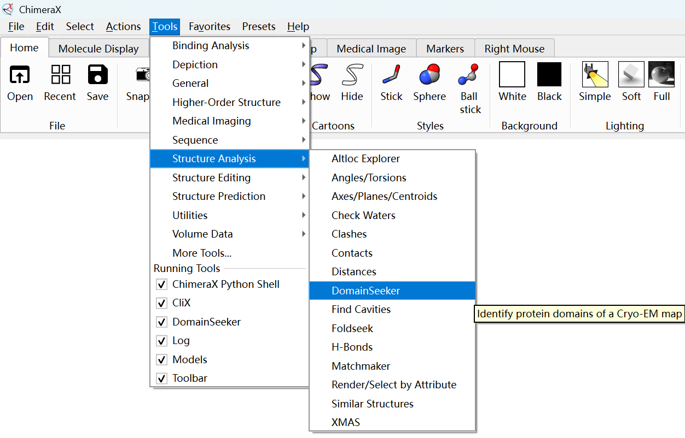

We show the interface of DomainSeeker here:

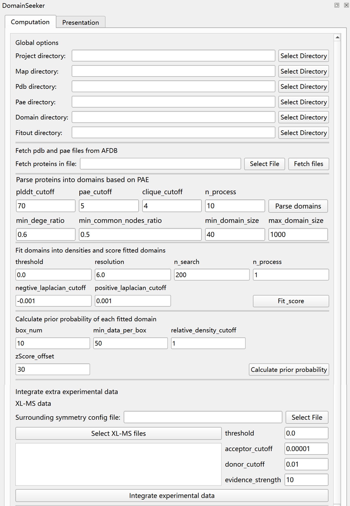

### Fetch pdb and pae files from AFDB

First of all, select the project directory in the "Global options" module of the plugin.

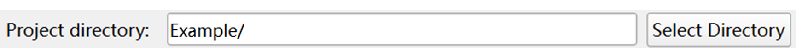

If you already have predicted structure files (.pdb) and PAE files (.json), place them into two separate folders and name them using the format "UniprotId.pdb" and "UniprotId.json". Then, select the corresponding folders in the "Global Options" module.

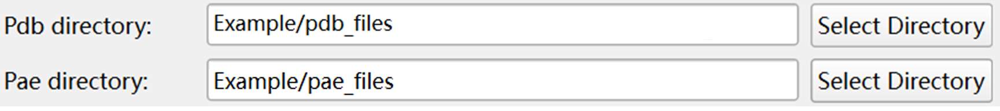

Alternatively, in the "Fetch pdb and pae files from AFDB" module, you can select a text file containing the UniProt IDs of all candidate proteins (with one UniProt ID per line) and click the "Fetch Files" button. DomainSeeker will then automatically download the corresponding PDB and PAE files, saving them in the folders specified by "Pdb Directory" and "Pae Directory" in the "Global Options" module.

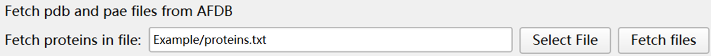

### Multimer structure support

DomainSeeker now supports AF3-predicted structures (including **multimers**). AF3-predicted structure files are typically named `fold_xxx_model_x.cif`, with PAE data saved in `fold_xxx_full_data_x.json`. Place these files into the pdb_files and pae_files folders respectively (renaming is optional, but recommended). The only requirement is that the structure and PAE files share the same base name (excluding extension). All subsequent steps process them identically to AF2 data. During domain parsing, .cif files will be automatically converted to PDB.

### Parse proteins into domains based on PAE

After obtaining the PDB and PAE files, click the "Parse Domains" button to perform domain partitioning based on the PAE information.  

When running with the data in the Example folder, setting n_processto 10 allows this step to complete in approximately 8 seconds.

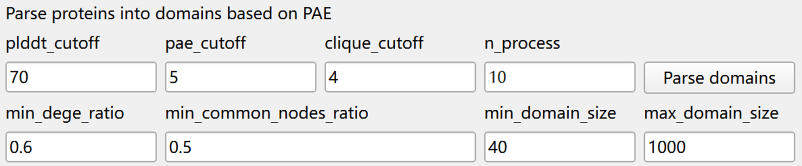

> **plddt_cutoff**: Residues with a pLDDT value above this threshold are included as nodes in the residue graph. Residues falling below the threshold are considered to have low prediction confidence and are excluded.  
> **pae_cutoff**: An edge is established between two residues if their average PAE exceeds this value.  
> **clique_cutoff**: Cliques containing at least this number of residues are treated as nodes in the cluster network; those smaller than the threshold are filtered out.  
> **min_edge_ratio** & **min_common_nodes_ratio**: In the residue network, two cliques are connected in the cluster network if they share at least *min_common_nodes_ratio residues*, or if the edge  between them reaches *min_edge_ratio*. Connected cliques collectively form a domain.  
> **min_domain_size**: Domains containing fewer than this number of residues are filtered out.  
> **max_domain_size**: Domains containing more than this number of residues are filtered out.  
> **n_process**: Number of parallel processes to use.  

The output files will be saved in the folder specified by the "Domain Directory" option in the "Global Options" module.Two types of output files are generated:

> **.pdb files**: Contain the coordinates of individual parsed domains.  
> **.domains files**: Record domain composition for each protein, including the residue ranges included in each domain.  

### Fit domains into densities and score fitted domains

For domain-density fitting, the EM density map must first be segmented (manually or automatically) into regions of interest, each saved as a separate .mrc file. Provide the path to the directory containing these files in the global option-"Map directory".

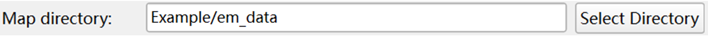

The image below shows two example regions used in this document:  

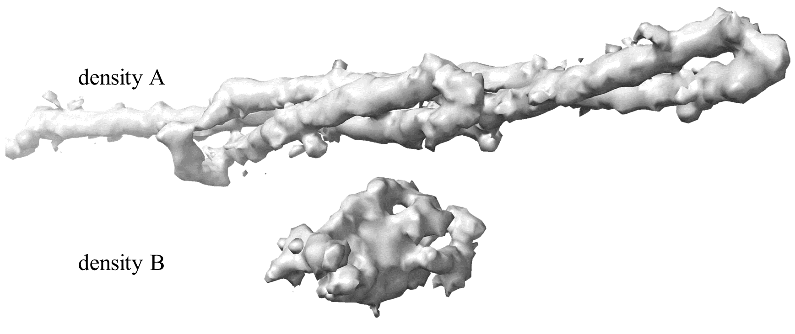

After specifying both the "Map directory" and "Domain directory" and assigning appropriate values to the parameters, click the "Fit_score" button to perform domain-density fitting.  

When running with the data in the Example folder, setting n_processto 10 allows this step to complete in approximately 80 seconds.  

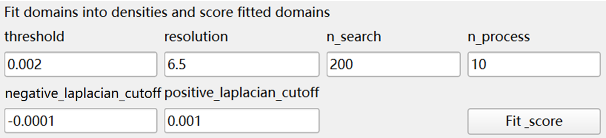  

> **threshold**: Electron density map threshold value.  
> **resolution**: Resolution of the electron density map, used to generate simulated densities for individual domains.  
> **n_search**: Number of initial starting positions for gradient-based correlation optimization. A value of 200 is recommended for typical domain sizes, balancing computational cost and accuracy. Larger density regions may require more starting positions for optimal fitting.  
> **negative_laplacian_cutoff** & **positive_laplacian_cutoff**: Parameters for evaluating overlap region matching. Set these to cover the main structural regions of the density map, while excluding noisy areas.  
> **n_process**: Number of parallel processes to use.  

After fitting, the file structure in the specified output folder ("Fitout Directory") is organized as shown in the image below. Within the results folder, each first-level subdirectory corresponds to one density map (e.g., "A.mrc" and "B.mrc" in the image) and contains the fitting results of all domains placed into that density.  

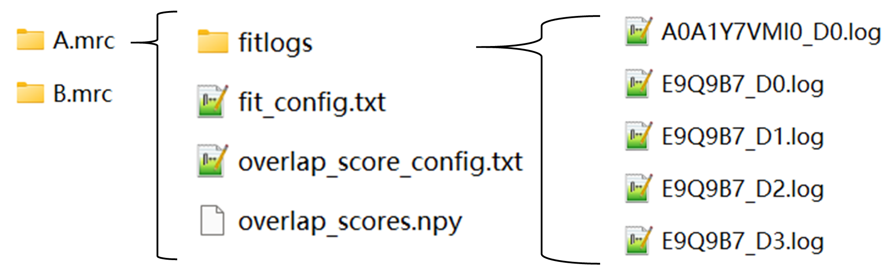  

Each density-specific subdirectory includes the following:  

> **fit_config.txt**: Fitting parameters used.  
> **fitlogs/**: Folder containing detailed fitting results per domain, including cross-correlations, hits, and transformation matrices.  
> **overlap_score_config.txt**: Parameters used for overlap region matching evaluation.  
> **overlap_scores.npy**: Results of the overlap region matching assessment between all domains and the density.  

### Calculate prior probability of each fitted domain

The following image displays the user interface and configurable parameters of the prior calculation module.  

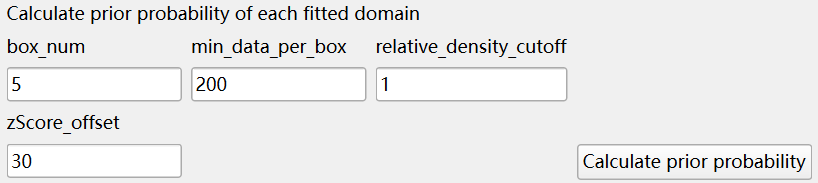  

> **box_num**: When calculating z-scores, data points are partitioned into a grid of box_num² cells based on their overlap volume and correlation values.  
> **relative_density_cutoff**: Relative density is defined as the ratio of the number of data points in a grid cell to the average number of data points across all cells. Only cells with a relative density above this threshold are used when calculating the average curve, to minimize the influence of anomalies.  
> **min_data_per_box**: After filtering cells by relative density, cells within the same overlap volume range are grouped into *box_num* bins. Each bin must contain at least *min_data_per_box* data points; otherwise, it is merged with an adjacent bin. The mean and standard deviation of the correlation values are computed for each bin to derive an interpolation function across overlap volumes.
> **zScore_offset**: The z-score is converted to a probability using a sigmoid function: `Sigmoid(zScore – offset)`.  

The output files generated from the prior calculation are shown in the image below:  

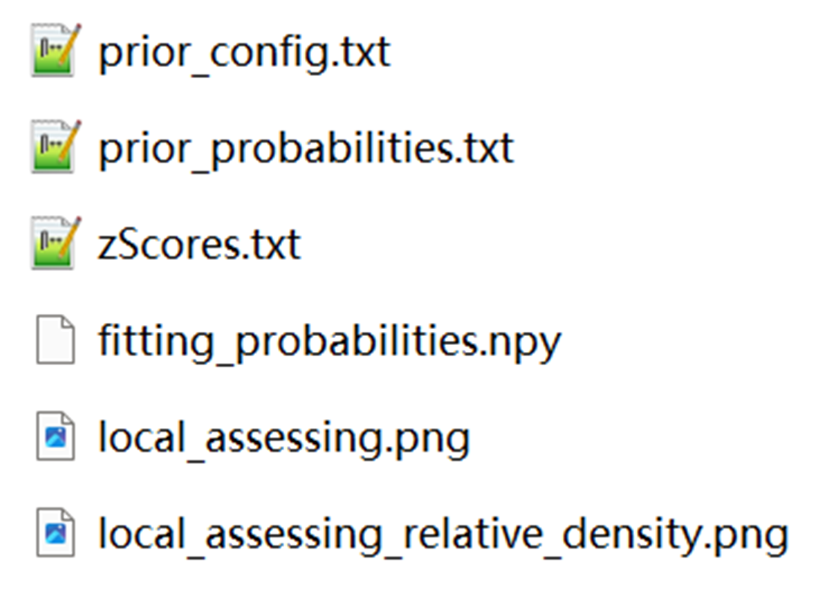  

> **prior_config.txt**: Contains the parameters used in the prior calculation.  
> **fitting_probabilities.npy**: Stores the overall probability scores evaluating all fitting positions for every domain.  
> **zScores.txt**: Records the overlap volume, correlation values, and the corresponding local z-score for each data point.  
> **prior_probabilities.txt**: Lists all fitting results ranked by their prior probability.  

The figures below illustrate the schematic diagrams of "local_assessing.png" and "local_assessing_relative_density.png". They display the distribution of data points, the mean and standard deviation curves, and the grid cells used for calculating these statistics. Users can examine these plots to evaluate whether the estimated mean and standard deviation curves are reasonable, and adjust parameters for recalibration if necessary.  

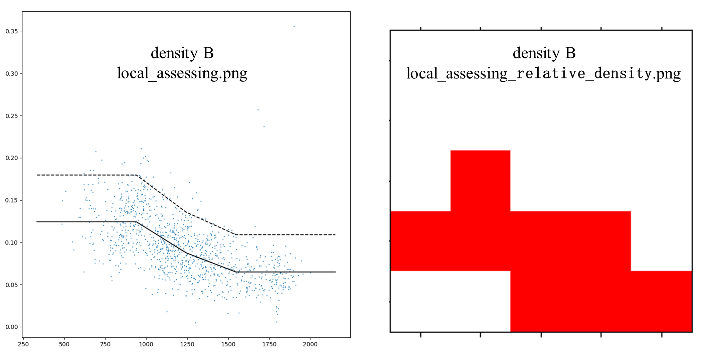  

The figure below illustrates how to visualize the results of the prior calculation.  

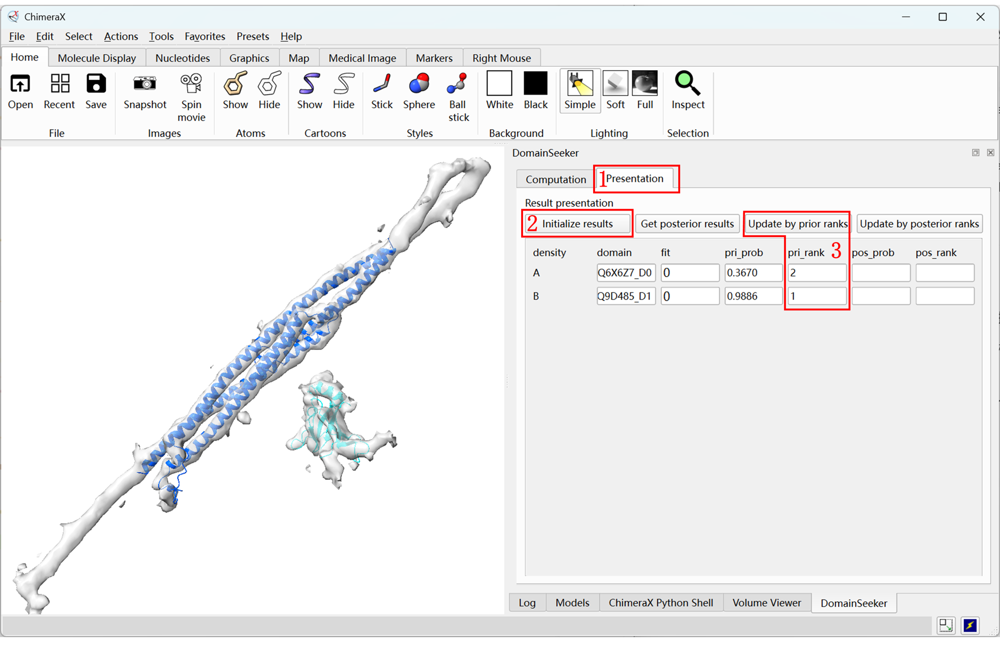  

1. At the top of the plugin interface, there are two tabs: "Computation"​ and "Presentation". Click on the  "Presentation"​ tab to access the results interface.  
2. In the "Presentation"​ tab, click "Initialize results"​ to load the results interface and import the prior calculation output. Then, each row in the table corresponds to a density map, displaying the prior probability (pri_prob) and ranking (pri_rank) of every fitted position for each domain. In addition to the numerical output, DomainSeeker automatically renders all density maps and their corresponding fitted domains in the main ChimeraX window for visual inspection.  
3. Users can manually adjust the prior rankings and click "Update by prior panks"​ to refresh the displayed results.  

In the results of the provided example, visual inspection reveals that the correct protein for density B is ranked first with high confidence. In contrast, for density A, the domain of the correct protein is ranked second, while the top-ranked structure appears to exhibit a slightly better visual fit.

### Integrate extra experimental data

To compute the posterior, the extracted density must preserve its relative positional information.

The figure below shows the interface and parameters of the posterior calculation module. The posterior calculation component is designed to incorporate data from multiple experimental sources, with cross-linking mass spectrometry (XL-MS) data integration currently implemented.

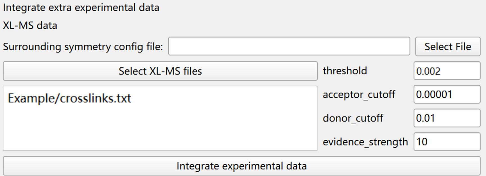

> **threshold**：The threshold value of the density map, used to determine whether two densities are adjacent.  
> **acceptor_cutoff** & **donor_cutoff**：These dual thresholds control which states participate in posterior calculations to reduce computational cost while preserving accuracy. States with prior probabilities exceeding the donor_cutoff may influence other densities, while those above the acceptor_cutoff may be influenced by external evidence. Only states meeting either threshold are included in the calculation.  
> **evidence_strength**：The strength of evidence provided by the cross-linking data. A higher value increases the impact of the cross-linking data on the final results.  


After completing all previous steps, select the file containing the crosslinking data (each line represents one crosslink pair in the format *UniprotId1:residueId1 UniprotId2:residueId2*), adjust parameters as needed, and click "Integrate Experimental Data"​ to perform the posterior calculation. This process integrates all experimental evidence to compute posterior probabilities.


The figure below shows the output files generated by the posterior calculation. The *posterior_config.txt* file in the project directory records the parameters used in the posterior calculation. Within the output folder for each density map, the *posterior_probabilities.txt* file contains all fitting results ranked by their posterior probability.

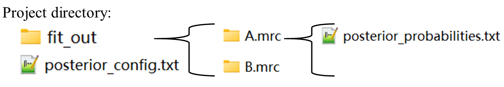

The figure below illustrates how to visualize the results of the posterior calculation. After loading the prior results in the Presentation​ tab, click "Get posterior results"​ to import and display the posterior outcomes. The posterior probability and ranking for each density map are shown in the corresponding entries. Users can update the displayed results based on the posterior rankings. DomainSeeker will also map the experimental evidence consistent with the selected state onto the structure (shown as red dashed lines representing crosslinks that agree with the structure in the figure).

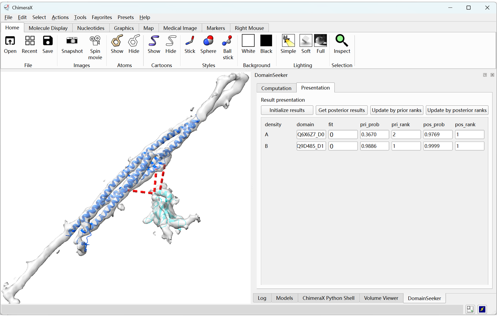    

The results show that after integrating the XL-MS data, the correct proteins are ranked first in both cases with high confidence. Furthermore, visual inspection confirms that both domains fit well into their respective density maps and are consistent with the additional experimental evidence, significantly increasing our confidence in the results.

#### Apply symmetry transformations to the density maps

DomainSeeker allows users to provide custom symmetry transformations. Users specify the symmetry operations that map the initial unit cell to adjacent positions in a JSON file. Since biological macromolecular assemblies typically involve only rotational and translational symmetry, users only need to provide, for each relevant symmetry operation, the symmetry axis, a reference point, the rotation angle and translation vector, together with the list of affected density regions. DomainSeeker then automatically generates symmetry-related copies and extends the scope of cross-link data accordingly.

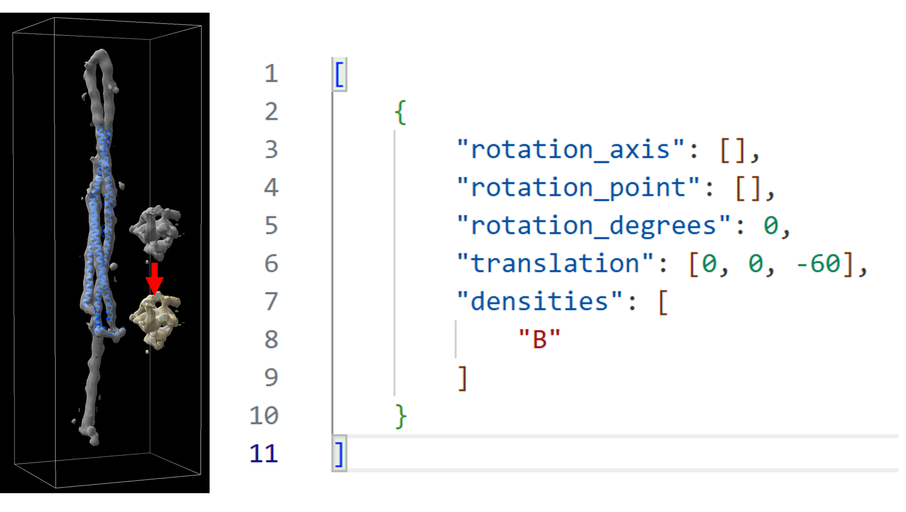

As shown in the figure above, the JSON file on the right configures a transformation that shifts density B downward by -60 Å along the z-axis. This transformation does not involve rotation, so the rotation configuration items remain at their default values (empty list or 0—these fields must be filled). Similarly, if a transformation does not involve translation, simply set the `translation` field to its default value (empty list—this field must also be filled).

To test the effectiveness of symmetry transformations, we provide a `crosslinks_symmetry_test.txt` file in the `Example` folder. It contains a single cross-link connecting density A and the transformed density B's corresponding domain.

Let us modify the posterior calculation input and recompute:

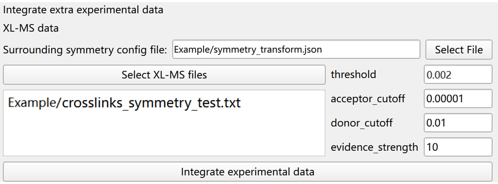

After the calculation completes, click the "Get posterior results" button again in the Presentation tab. The results are shown below:

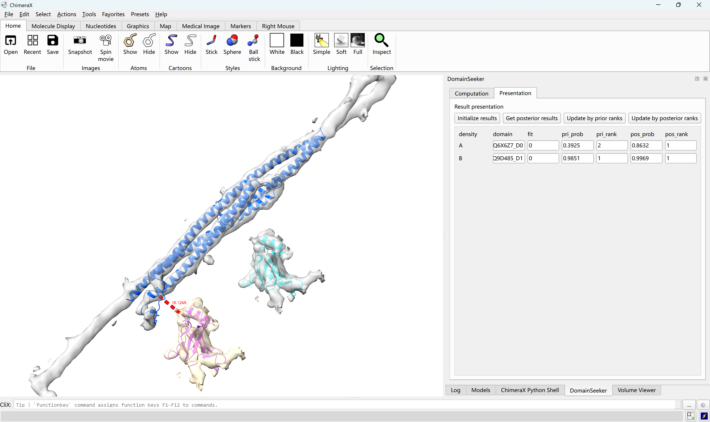

We can see that the cross-link between density A and the symmetry counterpart of density B elevates the correct assignment of density B to the first rank in the posterior results.


## Debug    
If there is no response after clicking the calculation button, please check the following:    
1. The program may be running in the background. Check the project folder to confirm whether the process is active.    
2. Open ChimeraX's **Log** panel (select **"Tools" → "General" → "Log"**) to view detailed messages. Info and warning messages appear in the Log panel, error messages are highlighted in red, and progress bars are displayed in the status bar.    
3. If the issue persists after the above steps, please report it on GitHub.  


# Command Line Usage

The scripts in `DomainSeeker_plugin/src/` can be invoked directly from the terminal, no separate CLI package needed.

## Installation

### Install ChimeraX

Install UCSF ChimeraX ≥1.6  [(https://www.cgl.ucsf.edu/chimerax/)](https://www.cgl.ucsf.edu/chimerax/).

Note: **Add ChimeraX to your system's PATH environment variable**.

### Install Python dependencies

1. Python ≥3.9
2. mdanalysis
3. gemmi
4. networkx
5. wget

## Workflow

### Fetch PDB and PAE files from AFDB

```
python fetch_pdb_pae.py protein_list.txt output_dir [pdb_dir] [pae_dir]
```

- `protein_list.txt` — a text file with one UniProt ID per line
- `output_dir` — parent directory for downloaded files
- `pdb_dir`, `pae_dir` — optional; if omitted, files are saved in `output_dir/pdb_files/` and `output_dir/pae_files/`

To download only PAE files (skip PDB):

```
python fetch_pdb_pae.py protein_list.txt output_dir --pae-only [pae_dir]
```

### Parse proteins into domains based on PAE

```
python parse_with_pae.py pdb_dir pae_dir domain_dir n_process [plddt_cutoff] [pae_cutoff] [clique_cutoff] [min_edge_ratio] [min_common_nodes_ratio] [min_domain_size] [max_domain_size]
```

Optional parameters default to: plddt_cutoff=70, pae_cutoff=5, clique_cutoff=4, min_edge_ratio=0.6, min_common_nodes_ratio=0.5, min_domain_size=40, max_domain_size=1000.

### Fit domains into densities and score fitted domains

```
python fit_with_chimerax.py domain_dir map_dir fitout_dir threshold resolution n_search negtive_laplacian_cutoff positive_laplacian_cutoff n_process
```

`threshold` and `resolution` can each be either a single float (applied to all densities) or a JSON file path mapping density names (without `.mrc` extension) to per-density values.

### Calculate prior probability of each fitted domain

```
python calculate_prior_probabilities.py map_dir fitout_dir box_num min_data_per_box relative_density_cutoff zScore_offset
```

### Integrate experimental data (posterior)

```
python calculate_posterior_probabilities.py project_dir domain_dir map_dir map_level fitout_dir acceptor_cutoff donor_cutoff evidence_strength symmetry_transform_file crosslink_file1 [crosslink_file2 ...]
```

- `map_level` — the threshold value of the density maps, used to determine adjacency
- `symmetry_transform_file` — path to a JSON file defining symmetry transformations (pass `"None"` if not needed)
- `crosslink_file1 ...` — one or more crosslink data files

### Visualize fitted domains (optional)

To generate PDB files of fitted domains for visual inspection:

```
python get_fitted_domains.py domain_dir fitout_subdir domain1 [domain2 ...]
```

- `fitout_subdir` — a density subdirectory inside fitout_dir (e.g., `A.mrc`)
- `domain1 ...` — domain names without suffix (e.g., `Q6X6Z7_D0`)
- Output PDB files are saved in `fitout_subdir/fitted_domains/`


# Citation


If you use DomainSeeker in your work, please cite the following preprint:


```
Lu, Y., Chen, G., Sun, F., Zhu, Y., & Zhang, Z. (2024). De novo identification of protein domains in cryo-electron tomography maps from AlphaFold2 models. bioRxiv, 2024.2011.2021.623534. https://doi.org/10.1101/2024.11.21.623534 
```